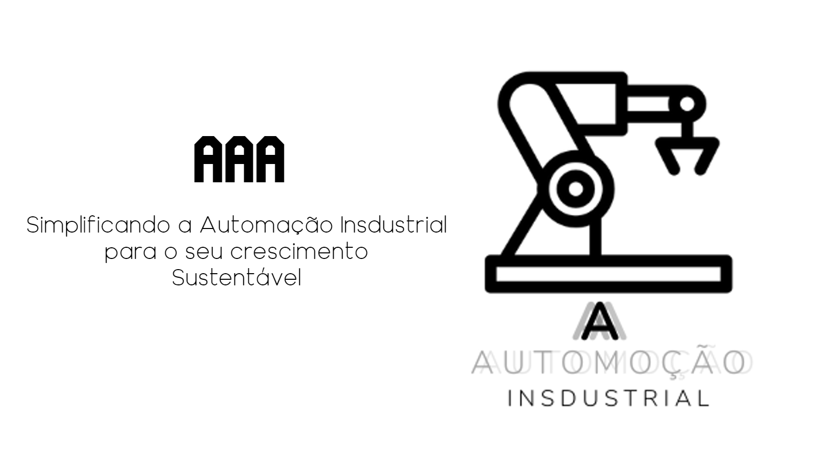

<!DOCTYPE html>

<html lang="pt-br">

    <head>

        <title>         Home | AAA Automação Industrial         </title>
        <meta charset="UTF-8">
        <meta name="keywords" content="Automatizar, automático, produção, maquinas, fresa, industrias, sequencia, torno, tecnológico, centro de usinagem, repetição, radial, furadeira, fabricas, evolução, valioso, tempo, perigoso, global, empregos">

    </head>

        <body>

            

<nav id="menu-h">
    <ul class="icones">

        <li>
            <a href="index.html">
                Home
            </a>
        </li>
               
        <li><a href="sobre.html">Quem Somos</a></li>

        <li><a href="serviços.html">Serviços</a></li>

        <li><a href="produto.html">Produtos</a></li>

        <li><a href="FAQ.html">FAQ</a></li>
       
        <li class="contato"><a href="cadastro1.html">Junte-se a Nós</a></li>
       
    </ul>
</nav>

            
            
            
            

            
                

                

            

        

             

        

            

               

            

            

                
                
Visite nosso espaço
  
                <iframe src="https://www.google.com/maps/embed?pb=!1m18!1m12!1m3!1d3679.1546582993665!2d-47.380210923839805!3d-22.759641032630512!2m3!1f0!2f0!3f0!3m2!1i1024!2i768!4f13.1!3m3!1m2!1s0x94c89c0461c615e1%3A0xbfd5ef6cf0872e00!2sR.%20Jo%C3%A3o%20Covolan%20Filho%2C%20420%20-%20Distrito%20Industrial%20I%2C%20Santa%20B%C3%A1rbara%20d&#39;Oeste%20-%20SP%2C%2013456-134!5e0!3m2!1spt-BR!2sbr!4v1687997594118!5m2!1spt-BR!2sbr" width="1380" height="795" style="border:0;" allowfullscreen="" loading="lazy" referrerpolicy="no-referrer-when-downgrade" class="mapa"></iframe>
                

    
            

        

             

        <footer class="rodape" id="contato">
            

        
                

                    

                        <!-- elemento -->
                        <b>Endereço</b>
                        
R. João Covolan Filho, 420 - Distrito Industrial I, Santa Bárbara d'Oeste - SP, 13456-134

                    

                

        
                

                    

                        <!-- elemento -->
                        <b>Contato</b>
                        
Suporte@AAA.automação

                        
+55 19 99200-0000

                    

                

        
                

                    

                        <!-- elemento -->
                        <b>Navegação</b>
                        
<a href="#">Home</a>

                        
<a href="#">Quem Somos</a>

                        
<a href="#">Serviços</a>

                        
<a href="#">Produtos</a>

                        
<a href="#">Contato</a>

                        
<a href="#">FAQ</a>

                    

                

        
            

                

                        <!-- elemento -->
                        <b class="RShd">Redes Sociais</b>
                    

                        

                        

 
                    
                    

                    
@AAAautomaçãoinds.

                    

                    

                    
AAA - AutomaçãoIndustial LTDA.

                    
                    
                    
                    

                

                
            

        
            

            
AAA Automação Industrial LTDA. - © Copyright 2023 - Todos os direitos reservados, Política de Privacidade - Desenvolvido por FJI Technology

        </footer>

        

        

        </body>

</html>
